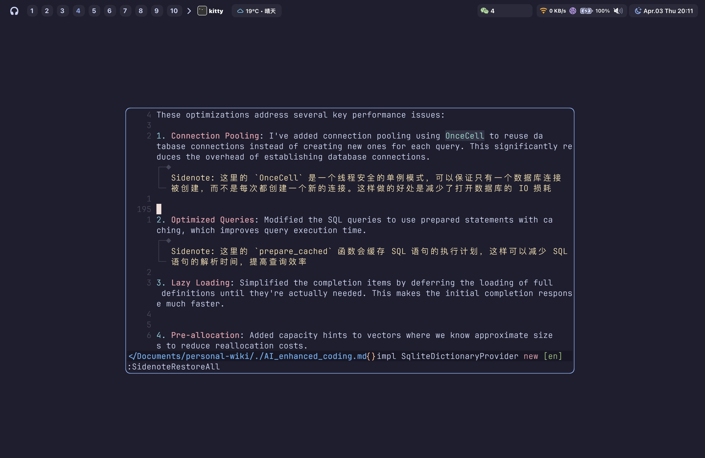

# sidenote.nvim: Generate and manage your sidenotes in Neovim

*WIP*: This plugin is still in development. The basic functionality is there, but there are still some bugs and missing features. There are many possible breaking changes. Be free to PR!

<p align="center">
  
</p>

## 🤔Introduction

Writing sidenote would be helpful while taking notes, writing articles, or even writing code. This plugin allows you to insert and manage sidenotes in your Neovim buffer. It uses a SQLite database to store the sidenotes, so you can easily restore them later.

The sidenote would highly configured for being compatible with folding text and CJK charactors (which always unrealized in neovim).


## 🛠Installation

Use your favorite plugin manager. For example, with `lazy.nvim`:

```lua
return {
  "pxwg/sidenote.nvim",
  event = "VeryLazy",
  dependencies = {
    { "kkharji/sqlite.lua" }, --- database for storing notes
  },
  opts = {
    input = {
      title = "Input",
      win_opts = {
        relative = "cursor",
        style = "minimal",
        border = "rounded",
        title_pos = "center",
      },
    },
    virtual_text = {
      hl_group = "Comment",
    },
  },
}
```

## 🖥Commands

| Command | Description |
| --- | --- |
| `:SidenoteInsert` | Inserts or updates a sidenote at the current cursor position. If a sidenote already exists at that line, opens an input dialog to update it. |
| `:SidenoteRestoreAll` | Restores and displays all sidenotes in the current buffer. |
| `:SidenoteFoldAll` | Removes all visible sidenotes from the current buffer without deleting them. |
| `:SidenoteTelescope` | Opens a Telescope interface to browse and navigate between all sidenotes. |
